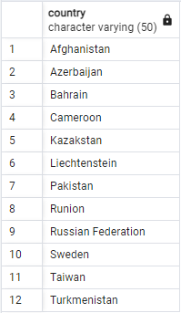

1. SELECT country FROM country
   WHERE country LIKE 'A%a';

   

2. SELECT country FROM country
   WHERE country LIKE '_ _ _ _ _%n';

   

3. SELECT title FROM film
   WHERE title ILIKE '%T%T%T%T%'

   

4. SELECT \* FROM film
   WHERE (title LIKE 'C%') AND (length > 90) AND (rental_rate IN (2.99));

   
